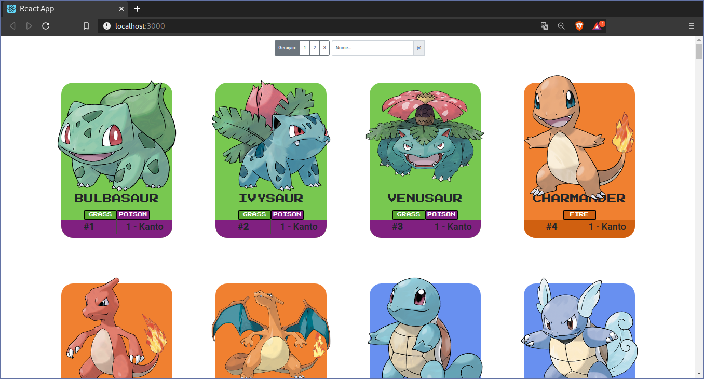

# pokedex
A simple Pokedex Web-site builded on ReactJS.
Created with `create-react-app`



### Usage
Start the server of Api:
```sh
$ cd server
$ npm install
$ npm start
```

After this, start the server of the Client React in the same way with React-Scripts:
```sh
$ cd client
$ npm install
$ npm start
```

